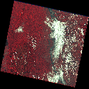

# Satellite Image Change Detection with LLM-Based Reporting

## Overview

This project detects changes between multi-temporal satellite images and generates structured natural-language reports using a Large Language Model (LLM). It combines deep learning–based segmentation with a reporting pipeline to make geospatial changes interpretable and actionable.

---

## Key Features

* Pixel-level **change detection** using U-Net–based architecture
* Works on **multi-temporal satellite imagery (T1 vs T2)**
* Generates **change maps + overlay visualizations**
* Produces **LLM-based textual reports**
* Interactive **Streamlit UI**
* Handles **real-world noisy and misaligned data**

---

## Demo

(Optional: add GIF here)

```

```

---

## Tech Stack

* **Deep Learning:** PyTorch, torchvision
* **Computer Vision:** OpenCV, rasterio
* **LLM Integration:** Local LLM / prompt-based reporting
* **Frontend:** Streamlit
* **Data Processing:** NumPy, Pandas

---

## Project Structure

```
├── app.py
├── inference.py
├── model.py
├── utils.py
├── local_llm.py
├── requirements.txt
├── .gitignore
├── change.gif
```

---

## Dataset & Model (IMPORTANT)

Due to size constraints, dataset and model weights are hosted externally.

### 🔗 Download Links

* **Dataset:** https://drive.google.com/drive/folders/1y5SKtV6yU4baV6xUI9oVjBFus_MamAG9?usp=sharing
* **Model Weights:** https://drive.google.com/drive/folders/198TdaaxOBEZ7vq0-uqGp5ckduBkfQ51B?usp=sharing

---

## Setup Instructions

### 1. Clone the repository

```bash
git clone https://github.com/your-username/satellite-change-detection.git
cd satellite-change-detection
```

---

### 2. Install dependencies

```bash
pip install -r requirements.txt
```

---

### 3. Download Data & Model

* Download dataset and model from the links above
* Place them in the following structure:

```
project/
├── data/
│   ├── northeast_1995_...
│   ├── northeast_2015_...
│
├── models/
│   └── siamese_unet.pth
```

---

### 4. Run the application

```bash
streamlit run app.py
```

---

## How It Works

1. Input two satellite images (before & after)
2. Preprocessing (alignment, normalization)
3. Change detection using U-Net
4. Post-processing to extract regions
5. Convert results → structured metadata
6. LLM generates human-readable report

---

## Challenges & Solutions

* **Misaligned images** → geometric preprocessing
* **Noise & false positives** → threshold tuning + post-processing
* **Class imbalance** → weighted loss (BCE + Dice)
* **CV → LLM gap** → structured metadata before LLM

---

## Use Cases

* Urban expansion monitoring
* Environmental change detection
* Disaster assessment
* Infrastructure tracking

---

## Future Improvements

* Multi-class change detection
* Real-time satellite integration
* Cloud deployment
* Faster inference optimization

---


